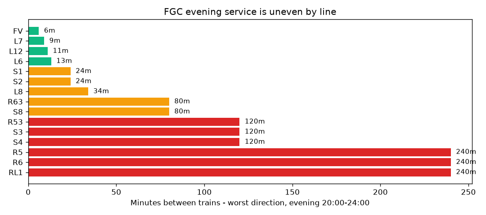

# FGC Evening Service

Weekday evening, 20:00-24:00 - prepared for the transport authority.

---

## Evening service is uneven

Riders on the thinner-served lines wait far longer for a train than riders on the core network.

---

## The gap is large

The best line runs every 6 minutes; the worst waits 240 minutes between trains - 40 times longer.

---

## Six lines are barely served

R53, S3, S4, R5, R6 and RL1 wait two hours or more between evening trains.

---

## The imbalance is structural

The best line runs 20 trains an hour; the worst runs one every two hours.

---

## Recommendation

Add evening trips on the lines waiting two hours or more, then re-check after the next timetable change.
